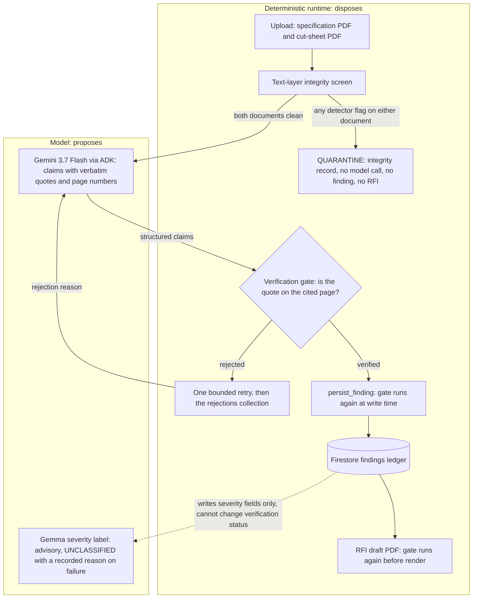

# SpecGuard

SpecGuard audits a construction cut sheet against a specification. Every finding carries one verbatim quote and page locator from each source document. A deterministic gate must locate both quotes on their cited pages before the finding reaches the Firestore ledger.

**Uncited claims are blocked from the ledger.**

The agent proposes; the runtime disposes. One Google ADK agent on Gemini 3.7 Flash reads the two documents and returns discrepancy claims, each with one verbatim quote and one page number per document. A deterministic runtime around the agent screens both documents before the model reads anything, verifies every quoted anchor, sends a rejected claim back to the model once, verifies again at write time, and drafts the RFI. The runtime has two modes, selected by `SPECGUARD_AGENT_MODE`. In `navigate`, the deployed default, the model receives the submitted document in full plus a one-line-per-page index of the specification, reads specification pages through read-only tools, and every model-initiated tool call is recorded on the run and shown on its page. In `full_text`, the code default for the library path, the model receives every page of both documents up front. In both modes the runtime owns every write: navigate registers no write tool to the model, and the gate verifies every claim whatever the model called. Navigation costs more prompt tokens than full text and is the default because it measured a higher catch rate on the hardest fixture lane, not because it is cheaper; [EVAL.md](EVAL.md) publishes both modes.

The gate establishes one narrow thing: each quoted text anchor occurs on its cited page. It does not establish that the finding is accurate, and nothing here claims zero hallucinations. A human reviews every finding.

## What is in this repository

- `specguard/gate.py`: the verification gate. Its contract is reproduced verbatim below.
- `specguard/integrity.py`: the text-layer integrity screen that runs before any model call.
- `specguard/agent.py` and `specguard/tools.py`: one ADK agent, five role-bound tools, the bounded one-retry loop, guarded Firestore persistence, and RFI draft PDF generation.
- `specguard/severity.py`: the advisory Gemma severity annotation with recorded fallback.
- `specguard/context.py`: the read-side page window that shows a verified quote inside its cited page.
- `specguard/web/`: the FastAPI findings page, the gate playground, guarded upload, the JSON run export, and durable run storage, deployed on Cloud Run.
- `scripts/eval_fixtures.py` and `EVAL.md`: the measured evaluation harness and its committed record.
- `scripts/reset_demo_ledger.py`: archive-then-clear for the demo ledger.
- `fixtures/`: five fictional, generated, text-based PDFs and their manifest.
- `tests/`: the offline test suite. Its size is recorded below from a real run, not typed here. `HANDOFF.md`, `REVIEW-P3.md`, and `REVIEW-CLAIMS.md` hold the receipts and the review findings behind every claim in this file.
- `scripts/record_test_count.py`: runs the suite and writes the count and its revision into this file.

<!-- test-count-start -->

`uv run pytest -q` exited 0 with **583 passed** on code revision `09c8294`. This line is written by `scripts/record_test_count.py` from that run's own summary line; it is not typed by hand. No test requires the network or credentials; every model, Firestore, and storage dependency is an in-process fake.

<!-- test-count-end -->

Deployed service: `https://specguard-108657628939.us-central1.run.app` (Cloud Run, us-central1, revision `specguard-00024-nst` as of 2026-08-22). Every public GET route reads only, with one stated exception: `GET /` also mints one upload submission token and records it, within a per-address hourly budget. Work that costs something — an audit, a sample audit, a gate check — is a POST. `POST /audit` requires a demo passphrase that is not in this repository.

**Try it.** Judges can run four public sample audits without a passphrase: Caldra (compliant), Veylan 208V, Torven 70 deg C, and Veylan altered (integrity screen). Uploading arbitrary PDFs stays gated to protect the demo budget.

**Run the gate yourself.** `/gate` calls `specguard.gate.verify_quote` on the committed fixtures and shows the verdict, the machine reason, the normalized quote, and the page count. It is the same function the runtime calls at write time. It makes no model call, writes no claim record, and needs no passphrase. Two one-click buttons show a rejection: one digit changed, and a real quote cited to the wrong page.

## Architecture



The honesty boundary is the edge from the model into the gate. Nothing the model emits reaches the ledger or the RFI without passing the gate, and the gate runs again inside the persistence tool and inside the RFI writer. The integrity screen sits before the model, so a flagged document never becomes model input.

The Gemma label sits after the ledger. It does write, and the diagram says so: the severity annotation updates `severity`, `severity_model_id`, `severity_endpoint_label`, `severity_status`, and `severity_reason` on a finding that is already in the ledger. It cannot change a verification status, a rejection reason, a quote, or a claim, and it cannot create a findings record: the update reads the finding first and refuses unless that record exists, belongs to the same run, and carries `verification_status == "verified"`.

## Verification contract

This is the exact claim SpecGuard defends. `specguard/gate.py` implements it and `tests/test_gate.py` proves it.

The scope of this construction is the SpecGuard application path. A separate process with direct Firestore write credentials is outside the Python API guarantee and can write to Firestore independently. Concurrent modification of the source files during a run is outside the guarantee for the same reason.

1. **Extraction.** The gate extracts the text of the cited page with PyMuPDF (pinned version). It reads that page and no other page.
2. **Normalization.** The gate normalizes the quote and the page text with the same steps, in this order:
   a. Unicode NFKC normalization.
   b. Rejoin a word broken by a soft hyphen: where a soft hyphen (U+00AD) sits between two **letters**, remove it together with any whitespace that follows it. A soft hyphen next to a digit never joins, so `1<U+00AD>2` stays two tokens and does not become `12`.
   c. Remove every remaining soft hyphen, leaving the surrounding whitespace alone.
   d. Casefold.
   e. Collapse every run of whitespace to a single space.
   f. Strip leading and trailing whitespace.
3. **Match.** The claim verifies only if the normalized quote is a contiguous substring of the normalized text of the cited page, and the substring sits on token boundaries: the match may not begin or end in the middle of a word or a number. A digit at the edge of the quote may not sit against a character that binds to a number either, so a claim quoting `5 A` cannot ride on the page text `0.5 A`. There is no fuzzy matching, no edit distance, and no cross-page search.
4. **A miss is a rejection, always.** Every rejection carries a machine-readable reason: `page_out_of_range` or `quote_not_found_on_cited_page`.

### What the contract does not claim

The gate proves one narrow thing: the quoted characters appear on the page that was cited. Everything below is outside that proof. This list is long on purpose, because the honesty claim is only worth as much as the list of things it does not cover.

- It does not claim the model tells the truth. A quote that is absent from the cited page is rejected. A true quote attached to a wrong conclusion is not something this gate can detect.
- It does not claim zero hallucinations.
- **Normalization merges some strings that mean different things.** Every item below is a real path to a wrong verification, each pinned by a test:
  - Casefolding erases case-sensitive units. A page reading `15 mW` and a claim quoting `15 MW` normalize identically, a millionfold difference. Case-insensitive matching is required by the contract, so this is a known cost of it, not a defect.
  - NFKC folds superscripts and subscripts into plain digits. A page reading `10²` normalizes to `102`. Cut sheets use `mm²` often.
  - Whitespace collapse discards layout. Text from two columns, two table cells, or a header and a body can end up adjacent, so a quote can splice text that never appeared together on the page.
- **It reads the text layer, not the visible page.** A PDF whose text layer disagrees with what a human sees, such as hidden text or an OCR layer over a scan, verifies against text the reader cannot see. A pure image scan carries no text and cannot verify anything. The gate is proven against generated text-based PDFs only. The integrity screen described below discloses one form of this disagreement before the model reads anything; the gate itself is unchanged and keeps reading the text layer.
- **The schema does not enforce that the gate ran.** `Finding.verification_status` is an ordinary field. The schema keeps the status and the rejection reason consistent, but a caller can construct a `VERIFIED` finding without calling `verify_quote`. The Firestore persistence tool does not trust that field. It re-verifies both quotes against the two source PDFs and performs no write if either quote rejects.
- SHA-256 in `DocumentRecord` is chain-of-custody metadata. It records which byte stream was read. It is not an accuracy mechanism and no part of the gate reads it.

## Text-layer integrity screen

A document from a third party is untrusted input. The known limitation above, that the gate reads the text layer and not the visible page, describes a real gap between what a human reviewer reads and what an automated reviewer ingests. This screen discloses several ways that gap opens. It narrows the gap. It does not close it.

`specguard/integrity.py` reads the file's bytes once, into one immutable snapshot, and derives the SHA-256, the page count, and the flag evidence from that snapshot, so a replacement during a screen cannot make the hash describe one byte stream while the evidence describes another. It reads PyMuPDF span data and PDF content streams only. It renders no image, runs no OCR, and compares no pixels. Five deterministic rules run over every page, in a fixed order. Every flag names the rule that raised it and states in one line what that rule read, and a flag from any rule quarantines the run on exactly the terms a render-mode-3 flag does. The screen identity stored beside every record is `text_layer_integrity_v2`; `v1` was the render-mode-3 rule alone.

### Detected (and how)

Each entry names the test that pins the detection and, where one exists, the test that pins the near-miss the rule must leave alone.

- **`render_mode_3` — text the render mode paints nowhere.** A PDF text-showing operator carries a render mode, and MuPDF records the outcome of that mode on every character. A span whose characters are neither filled nor stroked paints nothing for the reader while the text layer still carries the characters. That is render mode 3, the mode an OCR layer uses over a scanned image. Pinned by `tests/test_integrity.py::test_altered_fixture_is_flagged_on_the_expected_page`; the near-miss, outlined text drawn in stroke-only mode 1, is pinned by `test_a_stroked_only_span_is_not_flagged`.
- **`zero_alpha` — text the graphics state makes fully transparent.** Any painting, unclipped span whose alpha is 0. MuPDF reports the fill alpha for a filled span and the stroke alpha for a stroke-only one, so the rule covers a transparent fill and a transparent outline alike. PyMuPDF 1.28.2 exposes `alpha` on every span, and `test_pymupdf_exposes_span_alpha` fails if a later version stops. Pinned by `test_zero_fill_alpha_is_flagged` and `test_a_transparent_stroke_only_span_is_flagged`; the near-misses, faint text at alpha 0.2 and a painted outline, are pinned by `test_a_faint_but_painted_span_is_not_flagged` and `test_a_painted_stroke_only_span_is_not_flagged`. One conservative bias is deliberate: MuPDF reports fill-and-stroke render mode 2 with the filled flag alone, so a mode-2 span whose fill alpha is 0 while its stroke still paints is flagged although a reader can see it. Stroked-and-unfilled text is written in mode 1, not mode 2, so the case is rare, and the rule prefers a disclosure a human resolves over a miss nobody sees. Pinned by `test_a_stroke_that_paints_under_a_transparent_fill_is_still_flagged`.
- **`sub_visible_glyph` — glyphs too small to read.** A span whose effective size is below 1.0 pt. MuPDF reports `size` after the text matrix is applied, so a 10 pt font scaled to a twentieth by `Tm` is read as 0.5 pt and flagged. Pinned by `test_a_sub_point_glyph_is_flagged` and `test_a_matrix_scaled_glyph_is_flagged`; the near-misses, a 1.0 pt glyph and an unscaled text matrix, are pinned by `test_a_one_point_glyph_is_not_flagged` and `test_a_text_matrix_that_does_not_shrink_is_not_flagged`.
- **`content_stream_render_mode` — clip-only mode 7, and mode 3 in the raw stream.** The page's own content streams are tokenized and the `Tr` operator is tracked across `q`/`Q` and across `Do` into Form XObjects. Text shown under render mode 3 or 7 is flagged. This is the only rule that separates clip-only mode 7 from a filled-and-clipped mode 4, 5, or 6, because MuPDF reports the same character flags for both. Pinned by `test_clip_only_render_mode_seven_is_flagged`, `test_the_content_stream_scan_follows_a_form_xobject`, and `test_the_render_mode_is_restored_by_the_graphics_state_stack`; the near-misses, painted mode 4 and text clipped by an ordinary path, are pinned by `test_a_filled_and_clipped_render_mode_is_not_flagged` and `test_text_clipped_by_a_path_is_not_flagged`. Inline image bodies are stepped over rather than tokenized, so a crafted image cannot forge an operator. An unfiltered image's exact length is computed from its own `/W`, `/H`, `/BPC`, and `/CS`, because a body carrying a whitespace-delimited `EI` would otherwise end the step early and let the rest of its pixels run as operators. A filtered image has no computable length; when a hiding render mode is in effect at one, the rule flags the uncertainty rather than resolving it in the document's favour. Pinned by `test_an_inline_image_body_cannot_forge_a_render_mode`, `test_an_unfiltered_inline_image_cannot_forge_its_own_end`, and `test_a_filtered_inline_image_of_unknown_extent_is_disclosed`. Each `(form, inherited render mode)` pair is scanned once per page and a `Tr` operand outside 0 to 7 is ignored, so a document whose forms invoke siblings many times cannot expand the scan without bound; pinned by `test_a_fanned_out_xobject_chain_is_scanned_once_per_mode` and `test_an_out_of_range_render_mode_operand_is_ignored`. A mode-3 flag is suppressed when the span rule already reported that page, because both rules then describe the same concealment.
- **`out_of_crop_box` — text in the margin the crop box cuts away.** MuPDF clips extraction to the crop box, so the rule re-reads each cropped page from a second snapshot whose crop box has been widened to the media box, and flags any span whose rectangle does not intersect the original crop box. The pass is skipped when the two boxes are equal, which they are on every committed fixture. Pinned by `test_text_outside_the_crop_box_is_flagged`; the near-miss, a span the crop edge cuts through, is pinned by `test_a_span_partly_inside_the_crop_box_is_not_flagged`.
- **`soft_mask_hidden` — text a soft mask paints to nothing.** An ExtGState soft mask (`/SMask`) sets opacity from the graphics state, outside the span, so MuPDF reports the masked span's own `alpha` as opaque and the `zero_alpha` rule cannot see it. This rule tracks the `gs` operator across `q`/`Q` and into Form XObjects exactly as the render-mode rule tracks `Tr`, and it evaluates the mask rather than its presence: it reads the mask's transparency-group content stream and flags only a luminosity mask whose painted backdrop is near black, driving what it masks to near-zero opacity. Found in the Phase 7b-redteam sweep and closed here. Pinned by `test_a_luminosity_soft_mask_to_zero_is_flagged`; the near-misses — a mask that leaves text visible, a `/SMask /None`, an alpha-type mask, and a mask applied to an image rather than to text — are pinned by `test_a_soft_mask_that_leaves_text_visible_is_not_flagged`, `test_a_cleared_soft_mask_is_not_flagged`, `test_an_alpha_soft_mask_is_not_flagged`, and `test_a_soft_mask_on_an_image_does_not_flag_clean_text`. Two limits are disclosed: only luminosity masks are evaluated, not alpha masks, and a mask whose backdrop is a shading or an image is not flagged, so an all-dark shading mask is a known gap rather than a false quarantine of the honest gradient and image masks that share that construct.
- **The readable text of every page, beside the flags.** On a page with no flag that string is byte-identical to `page.get_text()`, so a clean page is reported exactly as the verification gate reads it. Pinned by `test_a_clean_page_reports_exactly_what_the_gate_reads`.

All five committed fixtures are the false-positive check for all five rules: the four originals raise no flag at all and the altered fixture raises render-mode-3 flags and nothing else. Pinned by `test_no_committed_fixture_trips_a_new_detector`.

### Not detected (and why)

Each entry names the test that pins the gap.

- **White, or near-background, text.** Deciding that a fill colour hides text needs the colour of whatever is painted behind it, which needs a raster comparison this screen does not make. Real cut sheets set white text on dark header boxes, so a colour heuristic here would quarantine honest documents. Pinned by `tests/test_integrity.py::test_white_text_on_a_white_background_is_not_detected`.
- **Text under a covering shape.** A rectangle drawn over painted text conceals it, and a redaction bar in a real submittal does exactly that on purpose. Separating the two needs the same raster comparison, so the screen reports neither. Pinned by `test_text_under_a_covering_rectangle_is_not_detected`.
- **Rasterized text.** Text drawn as an image carries no span and no render mode. The screen performs no OCR, by design. Pinned by `test_rasterized_text_is_not_detected`.
- **Text outside the media box.** MuPDF drops those glyphs from every extraction path the screen can reach, the widened-crop-box pass included. Pinned by `test_text_outside_the_media_box_is_not_detected`. The Phase 7b-redteam sweep re-measured this and several sibling structures — an optional-content group set off, a zero-area Form XObject box, a degenerate transform, a zero-area clip — and found each is a case where extraction returns nothing at all, so an automated reviewer never ingests the hidden text either. They are non-threats to this screen, not blind spots. Pinned across `tests/test_integrity_redteam.py`.
- **What a content-stream string says.** The `content_stream_render_mode` rule reads the render mode from the operator, which is exact. Where it cannot pair its finding with a MuPDF span it renders the raw string operand as Latin-1, which is exact for a simple encoding and approximate for a subset-encoded font. The mode is the claim; those bytes are not.
- **Intent.** A flagged page is a disclosure, not a verdict. The screen states that the text layer disagrees with the visible page and shows the disagreeing evidence. It does not decide why it is there.

### What the runtime does with a flagged document

The screen runs first, on both bound documents, before any extracted text is assembled into a model message. The run page and the JSON export name the detector and the evidence behind every flag; the model-facing summary tool still returns counts and page numbers only. `AuditRuntime.run` takes no argument that can skip it, so no caller of `run()` can opt out.

When either bound document carries at least one flag from any detector, the run is quarantined:

- No model call is made. The model receives no text from either document, because the model message carries both.
- The runtime attempts to write one deterministic integrity record per flagged document, into its own `integrity_findings` collection, holding the flagged text, the detector and evidence behind each flag, the page numbers, the document SHA-256, and the screen identity. The persistence tool takes one role name and reads the file again itself, so no caller and no model can author or edit that record. It is not a claim finding and it never passes through the verification gate.
- If that write is refused, or if the written record's hash does not match the hash the screen read, the summary reports the refusal reason instead of a record identifier. The quarantine still stands; only the record is missing.
- No claim finding is persisted and no RFI is drafted.
- The run summary reports the quarantine: the reason, each flagged document, its flagged pages, the detectors that flagged it, its flag count, and its SHA-256.

The runtime and its tools must be bound to the same two documents; a split binding is refused when the runtime is constructed. After extraction, the runtime re-reads both hashes and refuses to send text if either document changed since the screen read it. A writer that replaces a document and restores it inside that window is outside the guarantee, exactly as recorded above for the gate.

`check_text_integrity`, `extract_pdf_text`, and `verify_quote` are model-facing tools bound to a document role rather than a path. The agent can address only the specification or submitted document already bound to the audit. `check_text_integrity` returns the flag summary only, never hidden-span text, because handing that text back to the model would reopen the disclosure the screen exists to close. `extract_pdf_text` returns raw page text from its bound document, so the quarantine still stops a flagged document before any extraction happens. The runtime does not depend on the model calling any tool.

## Gemma severity annotation

After a finding passes the gate and is written to the ledger, the runtime asks a Gemma model for a severity label: LOW, MEDIUM, or HIGH. The label is advisory. It opens no path into the ledger, it never changes a verification status or a rejection reason, and a failed classification never blocks or fails an audit. Severity is not a compliance determination.

The receipted path is `google/gemma3@gemma-3-1b-it` on a dedicated Vertex AI Model Garden endpoint (one NVIDIA L4), selected by `SPECGUARD_GEMMA_ENDPOINT` and called with Application Default Credentials.

Provenance is recorded in two separate fields, because they are two different things.

- `severity_model_id` is the model identifier the endpoint reported in its own `predict` response. It is an observation. When the response names no model, this field stays empty rather than being filled in.
Both backends follow this rule, so the exported field means the same thing whichever one answered: the Vertex endpoint's identifier comes from its `predict` response, and the generativelanguage backend's comes from the response's reported model version.

- `severity_endpoint_label` is the configured label of the endpoint that was called, from `SPECGUARD_GEMMA_MODEL` or the default `google-gemma3-gemma-3-1b-it`. Nothing validates that string against the endpoint, so it records what this deployment was pointed at, never what served the request. The run page, the RFI, and the JSON export label it as an endpoint label for that reason.

The endpoint is deployed only for demo and evaluation windows and torn down afterwards, because the GPU bills while idle. Outside those windows the deployed service records `UNCLASSIFIED` on every new finding, with `severity_status = fallback` and `severity_reason = severity endpoint not deployed outside demo windows`. A reader who runs an audit later will see that state. It is the documented fallback, not a defect. The run page and each generated RFI show the recorded reason beside the fallback label.

`specguard/severity.py` also carries a generativelanguage API-key backend that the runtime selects when no endpoint is configured. It is not the receipted path: the last live probe returned HTTP 429 behind the AI Studio prepay wall, and the runtime recorded that outcome as a fallback with its reason. It reads its own variable, `SPECGUARD_GEMMA_API_MODEL`, defaulting to `gemma-4-31b-it`, which the 2026-08-21 `ListModels` probe in `HANDOFF.md` found on that API. The two backends no longer share one variable: a Vertex deployed-model name is not a generativelanguage model name, so one value was always wrong for one of them.

## Measured evaluation

The table below is generated by `scripts/eval_fixtures.py`, which runs the real runtime against Vertex AI over every audit case declared in `fixtures/MANIFEST.md` and publishes what it measured. The numbers are not edited by hand. A catch rate below 100 percent is published as measured.

<!-- eval-table-start -->

Measured on 2026-08-23 by `scripts/eval_fixtures.py`, 5 audits per document pair against the deployed Vertex AI model path, on code revision `1340748`, in `navigate` mode. Catch rate: 82% across every planted discrepancy. Not every case matched its declared expected outcome. The tables above show the measured numbers, including the cases that missed. SpecGuard does not catch every planted discrepancy on every run. Navigation mode met every condition of the ship gate and is the deployed default. EVAL.md publishes both modes. Column definitions and the full record are in [EVAL.md](EVAL.md).

| Case | Submitted document | Expected outcome | Catch rate | Decoy false positives | Quarantine rate | Severity distribution |
| --- | --- | --- | ---: | ---: | ---: | --- |
| `E-01` | `caldra_meridian_480v_switchboard.pdf` | `no_finding` | n/a | 0 | 0% | no findings |
| `E-02` | `veylan_arcworks_208v_switchboard.pdf` | `finding` | 100% | 0 | 0% | unclassified 5 |
| `E-03` | `torven_70c_termination_switchboard.pdf` | `finding` | 100% | 0 | 0% | unclassified 5 |
| `E-04` | `veylan_arcworks_208v_altered.pdf` | `quarantine` | n/a | 0 | 100% | no findings |
| `E-11` | `zarqelune_vantrel_package.pdf` | `finding` | 100% | 0 | 0% | unclassified 5 |
| `E-12` | `zarqelune_vantrel_package.pdf` | `finding` | 100% | 0 | 0% | unclassified 5 |
| `E-13` | `zarqelune_vantrel_package.pdf` | `finding` | 40% | 0 | 0% | unclassified 2 |
| `E-14` | `zarqelune_vantrel_package.pdf` | `finding` | 100% | 0 | 0% | unclassified 5 |
| `E-15` | `zarqelune_vantrel_package.pdf` | `finding` | 0% | 0 | 0% | no findings |
| `E-16` | `zarqelune_vantrel_package.pdf` | `finding` | 100% | 0 | 0% | unclassified 5 |
| `E-17` | `zarqelune_vantrel_package.pdf` | `finding` | 100% | 0 | 0% | unclassified 5 |
| `E-18` | `zarqelune_vantrel_package.pdf` | `no_finding` | n/a | 0 | 0% | no findings |
| `E-19` | `zarqelune_vantrel_package.pdf` | `no_finding` | n/a | 0 | 0% | no findings |

| Specification | Submitted document | Runs | Unattributed false positives | Rejections | Retries | Model turns | Mean prompt tokens | Model tool calls per run | Self-check rejections | Runs that returned a rejected quote |
| --- | --- | ---: | ---: | ---: | ---: | ---: | ---: | ---: | ---: | ---: |
| `asterquay_learning_workshop_specification.pdf` | `caldra_meridian_480v_switchboard.pdf` | 5 | 0 | 1 | 0 | 5 | 22719.4 | 6.8 | 0 | 0 |
| `asterquay_learning_workshop_specification.pdf` | `veylan_arcworks_208v_switchboard.pdf` | 5 | 0 | 0 | 0 | 5 | 34234.6 | 8.6 | 0 | 0 |
| `asterquay_learning_workshop_specification.pdf` | `torven_70c_termination_switchboard.pdf` | 5 | 0 | 0 | 0 | 5 | 36843.0 | 9.2 | 0 | 0 |
| `asterquay_learning_workshop_specification.pdf` | `veylan_arcworks_208v_altered.pdf` | 5 | 0 | 0 | 0 | 0 | n/a | 0.0 | 0 | 0 |
| `nimbrin_thermal_annex_specification.pdf` | `zarqelune_vantrel_package.pdf` | 5 | 3 | 0 | 0 | 5 | 227771.2 | 27.6 | 0 | 0 |

The table published on 2026-08-22 carried a different set of columns, so its cells cannot be compared with these one by one. The table above is the current measurement.

<!-- eval-table-end -->

**Provenance of the current table.** The table above was regenerated on 2026-08-23 by the harness at code revision `1340748`, which includes every Phase 7a, 7b, and 7c change, so the commit-range argument that stood here for the 2026-08-22 table is retired: the measured revision is the described revision. The generated table states, in its own last line, how it compares to the run before it.

**What moved since the 2026-08-22 run.** The column set changed with the two-lane, two-mode harness, so the cells are not comparable one by one. The original four cases report the same catch, false-positive, and quarantine outcomes as before. The severity column moved for a stated reason: this run executed with the severity sentinel (`SPECGUARD_GEMMA_ENDPOINT=disabled`), so every persisted finding carries `unclassified` with its recorded fallback reason, where the 2026-08-22 run had a live Gemma endpoint and labelled every finding `high`. Nothing in the classifier changed between the two records, and both records are published.

**The run arithmetic.** Five document pairs at five iterations each, in each of the two modes, is 50 audits. The altered fixture is quarantined before any model call, so its ten runs make zero model turns; the other 40 runs make one model turn each. The messy lane scores its nine declared cases from each of its five audits per mode, which is why 50 audits cover 26 case measurements.

Two things these numbers do not show. The gate rejected nothing and the runtime retried nothing in those 15 model-calling runs, because the model cited every quote correctly on the first turn, so this table is not evidence that the rejection-and-retry loop works; `tests/test_agent.py` and `tests/adversarial/test_runtime_separation.py` drive rejections deterministically and prove the loop. Severity is advisory and a fallback never blocks an audit, so a run with the endpoint down publishes `unclassified` labels and says why on each finding. The measurement covers five fictional fixtures, not a corpus of real submittals; it is not evidence of accuracy on documents outside this set.

## Reading a run

Each run page shows every persisted record for one audit.

- **Quote in context.** Beside each verified quote, the page shows a bounded window of the cited page with the matched text highlighted. The window is built from the gate's own extraction and the gate's own normalization, so a reader sees the text the gate compared, not a second rendering of it. `specguard/context.py` locates the occurrence with the gate's token-boundary rule rather than a copy of it, and it reports no window at all where the gate reports no match.
- **A rejected claim gets no window.** It has no verified anchor, so the page shows the machine reason the gate returned and the normalized quote it failed to find.
- **The windows are read once per run.** Building them downloads and reparses both stored PDFs, and run identifiers are public, so a reload would repeat that work indefinitely. Each run's window set is cached in the serving instance, keyed by a digest of the anchors it was built from. A run whose findings are still being written has a different digest, so it recomputes instead of serving a partial set. A failed read is never cached, because it can be transient.
- **JSON export.** `/runs/{run_id}/export.json` serves the same records as data: findings with both anchors, rejections with their parsed gate feedback, integrity records, document hashes, severity with its status and reason, the exact token usage, and the timestamps. The payload is built from an explicit field allowlist, so it carries no filesystem path, no upload passphrase, no submission token, and no hidden-span field the run page withholds from a human reader.

The generated RFI draft carries a header block, a findings table, the text-layer screen result for each document, the chain-of-custody hashes, and reviewer signature lines. The gate re-verifies every quote in the draft before it renders. Claim and quote text is model-generated and has no maximum length, so a table row taller than one page is written in slices under a repeated header rather than clipped at the page edge.

## Service hardening

Every response carries the same five headers.

- `Content-Security-Policy: default-src 'none'; script-src 'self'; style-src 'self' 'unsafe-inline'; img-src 'self' data:; font-src 'self'; form-action 'self'; base-uri 'none'; frame-ancestors 'none'`
- `X-Content-Type-Options: nosniff`
- `Referrer-Policy: no-referrer`
- `X-Frame-Options: DENY`
- `Strict-Transport-Security: max-age=31536000; includeSubDomains`

`script-src 'self'` allows no inline script, so the landing page's behaviour lives in `/static/index.js`. `style-src` still allows inline style, because the pages ship their stylesheet inside the document and no style rule can execute code.

`GET /healthz` returns `200 ok`. It reads no Firestore collection, no storage bucket, and no model endpoint, so it answers one question only: did this process start and can it serve. `GET /health` serves the same handler, and on Cloud Run it is the path that works: the Google Front End answers `/healthz` with its own 404 and never forwards the request to the container. That 404 carries none of the five headers above, which is how the interception is visible.

## What the test suite proves

Known-good cases that verify:

- An exact quote.
- A quote that differs only in letter case.
- A quote that differs in whitespace, including line breaks on either side.
- A quote whose word is split across a soft-hyphen line break on the page.
- A quote containing characters that NFKC normalizes, such as an fi ligature and a no-break space.

Known-bad cases that reject:

- A quote that is absent from the document.
- A real quote cited to the wrong page.
- A quote that spans two pages.
- A quote with one digit changed, such as 208 against 209.
- A quote with the unit changed, such as V against kV.
- A page number outside the document.
- An empty quote.
- A quote whose leading digit rides on a longer number: `5 A` against `0.5 A`, `5 kPa` against `-5 kPa`, `5%` against `±5%`, `500 kcmil` against `12,500 kcmil`, `1 unit` against `AHU-1 unit`.
- A quote that merges digits across a soft hyphen: `NEMA 12` against a page whose `NEMA 1` is broken by a soft hyphen before a `2`.

Known limitations, each pinned by a test so the limitation cannot quietly disappear:

- A page whose invisible text layer disagrees with the visible page verifies against the invisible text.
- A page with no text layer at all verifies nothing.
- Casefolding makes `15 mW` and `15 MW` identical.
- NFKC folds `10²` to `102`.
- Whitespace collapse makes text from separate columns adjacent.
- The schema cannot prove the gate was ever run.

Rejection-and-retry loop, driven without any network call:

- A rejected claim gets exactly one retry and then a recorded rejection.
- One retry can correct the quote, and the corrected claim is verified again before it persists.
- A retry must return exactly one corrected claim.
- The retry cap binds even when the scripted model still holds a valid third answer.
- Retry feedback carries only the gate result fields: rejection reason, normalized quote, page count.
- A malformed or absent model turn is recorded as `model_output_invalid` and does not abort the run.

Text-layer integrity screen:

- The altered demo fixture is flagged, on page 1, with both hidden span texts reported exactly.
- The four original demo fixtures produce zero flags, and the altered fixture raises render-mode-3 flags and nothing else. That is the false-positive check, run over all five fixtures and all five detectors.
- Each of the four detectors added after render mode 3 has a generated page it must flag and a near-miss page it must leave alone. The near-misses are a span the crop edge cuts through, a span at alpha 0.2, painted mode-4 text and text clipped by an ordinary path, and a glyph at exactly 1.0 pt.
- The content-stream scan follows `Do` into a Form XObject and carries the invoker's render mode with it, honours `q` and `Q`, steps over an inline image body rather than tokenizing it, and computes an unfiltered image's exact extent so its own bytes cannot end the step early.
- A fanned-out chain of Form XObjects is scanned once per form and inherited mode, so it cannot expand without bound, and the hidden line in its deepest form is still reported.
- A quarantine from a detector other than render mode 3 makes no model call, builds no message, and writes one integrity record naming that detector.
- On a clean page, the reported visible text equals the page text the gate reads.
- The altered fixture renders pixel-for-pixel identically to the unaltered one, so the difference is in the text layer alone.
- A quarantined document produces no model call and no model-visible message carrying the hidden text.
- The persisted integrity record carries the span evidence, the page numbers, and the document SHA-256, and two runs over one file store the same evidence.
- `AuditRuntime.run` accepts no argument that could skip the screen.
- Replacing the file mid-screen cannot split the reported hash from the reported evidence.
- The same bytes screen identically through a relative and an absolute path.
- A document replaced after the screen and before extraction never reaches the model.
- A runtime whose tools are bound to a different document pair is refused at construction.
- No registered agent tool except `extract_pdf_text` returns hidden span text.
- White-on-white text, text under a covering rectangle, rasterized text, and text outside the media box are not detected, each pinned by its own test.

Ledger invariant, adversarial suite in `tests/adversarial/`: the persistence tool runs the gate at write time even for a caller-set `VERIFIED` finding; a fabricated quote writes nothing; a stale verification carries no authority after the document changes; a finding with one, three, or two same-document quotes is refused with its exact reason; the stored finding carries hashes and no local path; `.collection(` appears in no runtime module except `specguard/tools.py` and `specguard/web/repository.py`.

The web repository is not read-only, and calling it that was wrong. It writes run records, submission tokens, and rate-limit counters. It writes no claim record: the findings, rejections, and integrity collections are written by `specguard/tools.py` alone. A test parses every runtime module and fails on any `set`, `update`, `create`, `delete`, or `add` that reaches the findings collection outside `persist_finding` and `update_finding_severity`, in either the direct or the batched call form.

Mutation testing is not automated. Two mutations were run by hand once and both were caught: reading page 2 for every later citation (`document[min(page_number - 1, 1)]`) failed 2 tests, and replacing `casefold()` with `lower()` failed 1. The receipts are in `HANDOFF.md`; re-run them by hand if the gate changes.

All test fixture content is fictional.

## Spin-up instructions

Prerequisites: Python 3.12, [uv](https://docs.astral.sh/uv/), and the Google Cloud SDK. The cloud steps need a project with Vertex AI, Firestore (native mode), Cloud Storage, Secret Manager, and Cloud Run enabled, and Application Default Credentials on the machine (`gcloud auth application-default login`). The model is `gemini-3.7-flash` at Vertex location `global`; regional Gemini 3.x endpoints returned 404 during setup.

1. Install and run the offline quality gates. No test touches the network.

```bash
uv sync
```

```bash
uv run pytest
```

```bash
uv run ruff check .
```

2. Call the gate directly.

```python
from specguard.gate import verify_quote

result = verify_quote("Receptacles shall be specification grade", 1, "spec.pdf")
result.verified  # bool
result.rejection_reason  # None, or a machine-readable reason
```

3. Run one complete audit from the command line against Vertex AI and Firestore. The command prints claims made, rejected, retried, findings persisted, the severity status with any fallback reason, and the RFI path. The model receives only extracted PDF text with one-based page markers. It does not receive fixture manifests or source file names.

```bash
uv run python run_audit.py --spec fixtures/asterquay_learning_workshop_specification.pdf --cutsheet fixtures/veylan_arcworks_208v_switchboard.pdf --project <your-project-id>
```

When the integrity screen flags either document, the command prints the quarantine instead: the reason, each flagged document, its flagged pages, the detectors that flagged it, its flag count, its SHA-256, and the identifier of the integrity record or the reason it was not written. No model call is made for that run.

4. Run the web service locally. Set `SPECGUARD_PROJECT`, `SPECGUARD_RUNS_BUCKET`, and `SPECGUARD_DEMO_PASSPHRASE` in the environment first; the passphrase is not stored in this repository. `SPECGUARD_GEMMA_ENDPOINT` is optional and names a Vertex endpoint for the severity annotation.

```bash
uv run uvicorn specguard.web.app:app --host 127.0.0.1 --port 8080
```

5. Deploy to Cloud Run. `deploy-specguard.ps1` is the deployment the receipts describe. It is written for the author's machine: it prefixes `PATH` with a local Cloud SDK path and names this project, bucket, runtime service account, Secret Manager secrets, and endpoint. Edit those values for another project.

```powershell
.\deploy-specguard.ps1
```

6. Optional Gemma endpoint for severity. Deploy `google/gemma3@gemma-3-1b-it` from Model Garden on `g2-standard-12` with one `NVIDIA_L4`, set `SPECGUARD_GEMMA_ENDPOINT` to the endpoint resource name on the service, and delete the endpoint and model after use. Without it, every finding records `UNCLASSIFIED` with a reason.

7. Measure and reset. `uv run python scripts/eval_fixtures.py -n 5` runs every fixture case N times against the live model path and rewrites `EVAL.md` and the table above. `uv run python scripts/reset_demo_ledger.py --confirm` archives the four run-scoped ledger collections and every bucket object under one timestamped key and then leaves them empty; without `--confirm` it prints what it would do and exits 2.

### Who can read a run

An upload run is reachable by its own URL and by nothing else. This is a capability-URL model, and it is stated here rather than implied.

- `POST /audit` redirects the uploader to `/runs/{run_id}`. That URL is the capability: anyone holding it can read the run page, the JSON export, and the RFI draft. Anyone without it cannot, because nothing publishes it.
- The run identifier is 128 bits from `uuid.uuid4().hex`. It is not sequential, not derived from the upload, and not guessable.
- The landing page lists sample runs only. An upload run is never listed, never linked from another page, and never enumerated by any route. There is no index of runs beyond that sample list. The filter runs in the service rather than in the Firestore query, because an equality filter plus an ordering needs a composite index; the page reads the newest 100 runs and keeps the newest 20 sample ones, so a burst of upload runs shortens that list but never makes it wrong.
- The consequence is the part a capability URL always carries: the URL is the credential. Whoever receives it, by a shared link, a browser history, or a copied address bar, can read that run. SpecGuard adds no second check, so an upload is as private as its URL is kept.
- The demo passphrase gates who may *start* an upload run. It does not gate who may read one afterwards.

### Service limits

Every public GET route reads only, except `GET /`, which mints and records one upload submission token per render. `POST /audit` requires the demo passphrase, accepts only `application/pdf`, and limits each upload to 5 MB. The landing page mints a one-time submission token server-side on every render and records it in Firestore with a one-hour expiry. That is a durable write on an unauthenticated read, so it is bounded twice: a `HEAD` probe mints nothing, and one address may mint 30 tokens per UTC hour. Past that budget the page renders without an upload form and says so; the sample audits and the gate playground need no token and still work. Set a Firestore TTL policy on `expires_at` for the `upload_submission_tokens` collection so spent records are removed rather than kept:

```powershell
gcloud firestore fields ttls update expires_at --collection-group=upload_submission_tokens --enable-ttl --project=specguard-hack
```
 `POST /audit` refuses a token this service never minted and a token whose expiry has passed; the reader is told to reload the page. Firestore claims the token and creates the `RUNNING` upload record in one transaction, so a replay of a used token returns the original run and starts no second audit. The transaction checks the expiry again, so a token that expires between the route's check and the write is still refused. Public sample audits are limited to six starts per client address per UTC hour and 60 starts per UTC day. The client address comes from the last entry of `X-Forwarded-For` only when `SPECGUARD_TRUST_FORWARDED_FOR=1`, which `deploy-specguard.ps1` sets because Cloud Run appends the real peer address there. Without that variable the header is ignored entirely and the limit is keyed on the connection's own peer address, because outside such a proxy the header is only what the caller typed and honouring it would let one caller reset every limit. A refused request renders as a page that says nothing failed and nothing was recorded, and the sample limit points the reader at the gate playground, which makes no model call. `POST /gate` is limited to 60 checks per that address per UTC hour. `GET /gate` costs nothing and counts nothing: it serves a verdict for the prefilled example that was verified once, at import, from a committed fixture, so the route parses no PDF per request. Firestore owns both counters, so a cold start cannot reset either budget. The service is deployed with `--max-instances 1` and `--concurrency 2`, and each instance runs at most two in-flight audits, so in steady state the service accepts two concurrent audits. The instance cap is the load-bearing half of that number: with two instances the same request concurrency would allow four. The cap is a per-revision target rather than a hard service-wide ceiling, because Cloud Run may briefly run additional instances during a deployment or a traffic split, so two is the steady-state figure and not a guarantee for every instant. Cloud Run compute is ephemeral. The uploaded PDFs and generated RFI PDFs are durable Cloud Storage objects keyed by run ID, with each object SHA-256 recorded in the Firestore run document. A failed audit remains visible as `FAILED` with its stored source-object records. If both FAILED writes fail, Firestore keeps `RUNNING`; a read older than ten minutes displays `STALLED` without changing the stored record. A completed run with no persisted findings has no RFI and displays `No RFI — no discrepancies found.`

## Limitations and completion board

This board mirrors the Phase 6d board in `HANDOFF.md`. `FIXED` rows name the change commit. `ACCEPTED` rows name why no further change is made and where the limit is disclosed.

| Origin | Recorded item | State |
| --- | --- | --- |
| P3 | An RFI could render hand-built, unverified findings. | FIXED — `206378a` re-verifies both quotes before rendering. |
| P3 | A process with direct Firestore credentials can bypass the application path. | ACCEPTED — SpecGuard cannot control independent credentials; disclosed in [Verification contract](#verification-contract). |
| P3 | A concurrent source-file replacement can race the hash checks. | ACCEPTED — one local audit has no practical lock over another writer; disclosed in [Verification contract](#verification-contract). |
| P3 | A malformed model turn could abort without a recorded rejection. | FIXED — `206378a` records `model_output_invalid`. |
| P3 | No receipt proves a model initiated a registered tool call. | FIXED — `3c09dc5` records every model-initiated call (`model_tool_calls`) with tool, arguments, and turn; measured across 50 audits in EVAL.md; the runtime still owns every write. |
| P3 | The Firestore fake does not model all transaction semantics. | ACCEPTED — current writes are flat and the real transaction paths have route coverage; disclosed in `REVIEW-P3.md` F7. |
| P3 | A retry can replace its rejected claim with another verified claim. | ACCEPTED — claim identity is prompt-governed and no safe semantic comparator exists; disclosed in `REVIEW-P3.md` F9. |
| P3 | Casefolding can merge case-sensitive units. | ACCEPTED — the gate contract requires casefolding; disclosed in [What the contract does not claim](#what-the-contract-does-not-claim). |
| P3 | NFKC can flatten superscripts or subscripts. | ACCEPTED — the gate contract requires NFKC; disclosed in [What the contract does not claim](#what-the-contract-does-not-claim). |
| P3 | Whitespace collapse can join separate layout regions. | ACCEPTED — layout recovery needs a different gate; disclosed in [What the contract does not claim](#what-the-contract-does-not-claim). |
| P3 | Text-layer matching differs from the visible page and cannot read image-only PDFs. | ACCEPTED — the gate remains text-based; disclosed in [What the contract does not claim](#what-the-contract-does-not-claim). |
| P3 | The schema cannot prove the gate ran. | ACCEPTED — write-time re-verification is the enforcement point; disclosed in [What the contract does not claim](#what-the-contract-does-not-claim). |
| P3.5 | Raster text is not visible to the text-layer integrity screen. | ACCEPTED — the screen performs no OCR or raster comparison; disclosed in [Not detected (and why)](#not-detected-and-why) and pinned by `test_rasterized_text_is_not_detected`. |
| P3.5 | Clip-only render mode 7 cannot be separated from painted text. | FIXED — `d421262` reads the mode from the content stream, which the character flags cannot reach; disclosed in [Detected (and how)](#detected-and-how). |
| P3.5 | Zero fill alpha can conceal text. | FIXED — `d421262` reads the span's own alpha, which PyMuPDF exposes; disclosed in [Detected (and how)](#detected-and-how). |
| P3.5 | Text outside the crop box can conceal text. | FIXED — `d421262` re-reads each cropped page with the crop box widened to the media box; disclosed in [Detected (and how)](#detected-and-how). |
| P3.5 | White-on-white text and covering rectangles can conceal text. | ACCEPTED — both need the colour of what is painted behind the text, so a heuristic would quarantine honest cut sheets and redacted submittals; disclosed in [Not detected (and why)](#not-detected-and-why). |
| P3.5 | The screen cannot determine concealment intent. | ACCEPTED — it reports evidence, not a motive; disclosed in [Not detected (and why)](#not-detected-and-why). |
| P7b | Sub-point glyphs can carry text no reader can read. | FIXED — `d421262` flags any span whose effective size is below 1.0 pt, matrix scaling included; disclosed in [Detected (and how)](#detected-and-how). |
| P7b | Text placed outside the media box is invisible to the screen. | ACCEPTED — MuPDF drops those glyphs from every extraction path, the widened-crop-box pass included; disclosed in [Not detected (and why)](#not-detected-and-why) and pinned by `test_text_outside_the_media_box_is_not_detected`. |
| P7b | A content-stream string operand is rendered as Latin-1, which a subset-encoded font does not honour. | ACCEPTED — the rule's claim is the render mode, read from the operator; where a MuPDF span pairs with the finding the exact text is used instead; disclosed in [Not detected (and why)](#not-detected-and-why). |
| P7b | A fill-and-stroke mode 2 span with a transparent fill and a painting stroke is flagged although a reader can see it. | ACCEPTED — MuPDF reports mode 2 with the filled flag alone, so the rule cannot separate it from an invisible mode-0 span; it errs toward the disclosure and the bias is pinned by `test_a_stroke_that_paints_under_a_transparent_fill_is_still_flagged`. |
| P7b-redteam | A soft mask (`/SMask`) can drive a text span's opacity to zero from the graphics state, which the span-alpha rule cannot see. | FIXED — the `soft_mask_hidden` detector tracks `gs` through the graphics-state stack and Form XObjects and evaluates the mask's group luminosity, flagging a near-black mask over text; disclosed in [Detected (and how)](#detected-and-how), pinned by `test_a_luminosity_soft_mask_to_zero_is_flagged` with four honest near-misses that stay clean. |
| P7b-redteam | Eleven concealment mechanisms across the PDF imaging model were measured against the screen. | FIXED — `tests/test_integrity_redteam.py` pins extraction, rendered visibility, and screen result for each, so the Detected / Not detected list is now a receipt rather than a claim; the soft-mask miss is now closed by a detector, white text remains the one accepted miss, and the rest are detected or non-threats where extraction returns nothing. |
| P4 | The passphrase is checked after multipart parsing. | ACCEPTED — multipart form fields require parsing first; Cloud Run bounds request size; disclosed in `HANDOFF.md` Phase 5 review. |
| P4 | Browser-side file checks are advisory. | ACCEPTED — server validation remains authoritative; disclosed in `HANDOFF.md` Phase 5 UI pass. |
| P4 | Cloud Run concurrency is a steady-state target, not an instant-wide maximum. | ACCEPTED — Cloud Run may overlap instances during deploys or traffic splits; disclosed in [Service limits](#service-limits). |
| P4 | A run can remain `RUNNING` if both FAILED-record writes fail. | FIXED — `f058e65` displays `STALLED` after ten minutes without rewriting Firestore; disclosed in [Service limits](#service-limits). |
| P4 | A replayed POST, a second tab, or form.submit() could mint a duplicate run. | FIXED — `f058e65` one-time submission token; a replay returns the original run; receipted in `HANDOFF.md` Phase 6d. |
| P4 | A reset can race with a live writer. | ACCEPTED — the reset is for one operator on an idle service; disclosed in `HANDOFF.md` Phase 6a. |
| P6c | A cold start reset the six-per-address hourly sample limit. | FIXED — `f058e65` stores the hourly and daily reservations in one Firestore transaction. |
| P6c | The run page omitted the recorded severity reason. | FIXED — `f058e65` renders the reason on the run page and in the RFI. |
| P6c | A completed zero-finding run created an empty RFI. | FIXED — `f058e65` creates no RFI and shows `No RFI — no discrepancies found.` only when no claim was rejected. |
| P6d | A zero-finding run with rejected claims could claim that no discrepancy existed. | FIXED — `f058e65` says that no finding was verified and directs the reader to rejections. |
| Severity | An endpoint timeout or error can leave severity unclassified. | ACCEPTED — severity is advisory; one 15-second retry handles a timeout or 5xx response, then the recorded fallback reason explains the result. |
| Severity | Severity does not prove verification or compliance. | ACCEPTED — it is an annotation after gate verification; disclosed in [Gemma severity annotation](#gemma-severity-annotation). |
| Evaluation | No run has a total Vertex spend figure. | ACCEPTED — the harness output exposes no cost value and SpecGuard does not estimate one; disclosed in `EVAL.md`. |
| Evaluation | Per-run Gemini usage is unavailable when ADK omits usage metadata. | ACCEPTED — SpecGuard records that fact and never estimates tokens; disclosed on each run page and in `EVAL.md`. |
| Evaluation | Fixture evaluation did not exercise live gate rejections or retries. | ACCEPTED — the fixtures produced no rejected claim; disclosed in [Measured evaluation](#measured-evaluation). |
| Evaluation | Fixture results do not show accuracy on real documents. | ACCEPTED — the suite uses fictional fixtures only; disclosed in `EVAL.md`. |
| P6e | The gate playground reads only the committed fixtures, never an uploaded file. | ACCEPTED — accepting arbitrary uploads on an unauthenticated GET route would reopen the upload budget the passphrase protects; disclosed on `/gate` and in [Try it](#specguard). |
| P6e | The quote window is normalized text, not the painted page. | ACCEPTED — the gate compares normalized text, so a window built from the raw page would show a reader something the gate never matched; disclosed in [Reading a run](#reading-a-run). |
| P6e review | Every run page GET downloaded and reparsed both stored PDFs, with no cache. | FIXED — `4f870c7` caches one window set per run, keyed by a digest of the anchors it was built from, so a reload reads nothing and a run still writing findings recomputes. A failed read is never cached. |
| P6e review | A findings-table row taller than one RFI page was clipped, not split. | FIXED — `4f870c7` writes such a row in slices under a repeated header, and moves a row whole only when a fresh page would actually hold it. |
| P6e | The Content-Security-Policy still allows inline style. | ACCEPTED — the requirement is that no inline script runs; the pages ship their stylesheet inside the document and no style rule can execute code; disclosed in [Service hardening](#service-hardening). |
| P6e | `/healthz` reports process liveness only, never dependency health. | ACCEPTED — a check that called Firestore or Vertex would report that dependency's health under this route's name; disclosed in [Service hardening](#service-hardening). |
| P6e | The Cloud Run front end answers `/healthz` itself and never forwards it. | ACCEPTED — the platform owns that path; `/health` serves the same handler and is the reachable path on the deployed service; disclosed in [Service hardening](#service-hardening). |
| P6e | The JSON export is a read-side view and proves nothing the run page does not. | ACCEPTED — it serves the same persisted records from an allowlist; the ledger invariant is enforced at write time, not at export. |
| Review 7a | The landing page published every run, so an upload run reached every later visitor. | FIXED — `f0d33bb` lists sample runs only; an upload run is reachable by its own 128-bit URL and is never enumerated; disclosed in [Who can read a run](#who-can-read-a-run). |
| 7a review | Minting a token on every public read was an unbounded Firestore write surface. | FIXED — `c0a380e` mints nothing for a `HEAD` probe and caps mints at 30 per address per UTC hour; over budget the page renders without the upload form; a Firestore TTL policy on `expires_at` removes spent records; disclosed in [Service limits](#service-limits). |
| 7a review | Filtering sample runs after the query limit could empty the public list. | FIXED — `c0a380e` reads the newest 100 runs and keeps the newest 20 sample ones; disclosed in [Who can read a run](#who-can-read-a-run). |
| 7a review | The generativelanguage backend still reported its configured request name as `severity_model_id`. | FIXED — `c0a380e` reads that response's reported model version and records the request name as the endpoint label, so one rule covers both backends. |
| Review 7a | The published evaluation names `a424ccf`, and Phase 7a changed files inside the measured path. | FIXED — the harness re-ran on 2026-08-23 at `1340748`, both modes and both lanes, with the severity sentinel disabled and every fallback reason recorded; the table above is that run. |
| 7c | `E-15` (0 of 5) and `E-13` (2 of 5) are published misses on the messy lane in both modes. | ACCEPTED — published as measured in EVAL.md and the table above; whether the planted pairs are genuinely hard or mis-specified is a Phase 7d question. |
| 7c | `full_text` mode registers the write tools to the model, as it always has. | ACCEPTED — every write path runs the gate at write time; the deployed default is navigate, which registers no write tool; disclosed in the introduction. |
| 7c | The EVAL self-check totals were measured under the digest-counting rule. | ACCEPTED — corrected in `19599a7` to count calls and anchor-match; the published totals stand as measured and the next regeneration uses the corrected rule. |
| Review 7a | README stated a hand-typed test count. | FIXED — `ba1be8d` generates the count and its revision from a real `uv run pytest -q` receipt; disclosed in [What is in this repository](#what-is-in-this-repository). |
| Review 7a | README called the web repository read-only, and its diagram called the severity annotation "never a write path". | FIXED — `ba1be8d` states that the repository writes runs, tokens, and rate-limit counters but no claim record, and that the severity annotation writes severity fields and cannot change a verification status. |
| Review 7a | A configured model label was stored as `severity_model_id`, so provenance published an observation nobody made. | FIXED — `6f27d92` records the identifier the endpoint reports as `severity_model_id`, and the configured string as `severity_endpoint_label`; the two backends read separate model variables; disclosed in [Gemma severity annotation](#gemma-severity-annotation). |
| Review 7a | `X-Forwarded-For` was honoured everywhere, so a local or directly reachable deployment let a caller reset every per-address limit. | FIXED — `6bdd747` reads the header only under `SPECGUARD_TRUST_FORWARDED_FOR=1`, which the deploy script sets; disclosed in [Service limits](#service-limits). |
| Review 7a | The header set carried no HSTS, so a browser could send the first request of a session in the clear. | FIXED — `6bdd747` adds `Strict-Transport-Security: max-age=31536000; includeSubDomains` to every response; disclosed in [Service hardening](#service-hardening). |
| Review 7a | `GET /gate` parsed a fixture PDF per request and spent a rate-limit slot, so a public GET route did work and wrote a counter. | FIXED — `f767bdb` moves every check to `POST /gate`; the GET serves a verdict computed once at import; disclosed in [Service limits](#service-limits). |
| Review 7a | `POST /audit` accepted any string as a submission token, because none was ever recorded. | FIXED — `55afbad` mints every token server-side on page render and records it with a one-hour expiry; an unminted or expired token is refused in the route and again in the create-run transaction; disclosed in [Service limits](#service-limits). |
| Review 7a | A run URL is the whole access control on an upload run. | ACCEPTED — this is a capability-URL model: the URL is the credential, and anyone holding it can read the run; disclosed in [Who can read a run](#who-can-read-a-run). |

## Review records

- `HANDOFF.md`: phase-by-phase receipts, every quality-gate command with its exit code, real-run summaries, review findings and what was done with each.
- `REVIEW-P3.md`: the independent adversarial audit of the ledger invariant, with its 16 bypass attempts.
- `REVIEW-CLAIMS.md`: the claims audit of this file against the code, tests, and receipts, plus the pre-publication sweep.
- `EVAL.md`: the measured evaluation record with every run identifier.

## License

Apache License 2.0. See `LICENSE`.
