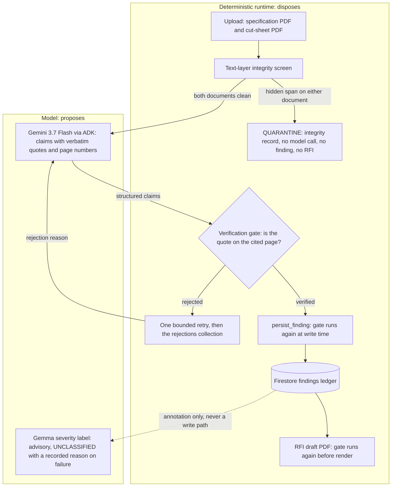

# SpecGuard

SpecGuard audits a construction cut sheet against a specification. Every finding carries one verbatim quote and page locator from each source document. A deterministic gate must locate both quotes on their cited pages before the finding reaches the Firestore ledger.

**Uncited claims are blocked from the ledger.**

The agent proposes; the runtime disposes. One Google ADK agent on Gemini 3.7 Flash reads the two documents and returns discrepancy claims, each with one verbatim quote and one page number per document. A deterministic runtime around the agent screens both documents before the model reads anything, verifies every quoted anchor, sends a rejected claim back to the model once, verifies again at write time, and drafts the RFI. The runtime calls the tools itself. No receipt in this repository shows a model-initiated tool call, and the runtime does not depend on the model calling any tool.

The gate establishes one narrow thing: each quoted text anchor occurs on its cited page. It does not establish that the finding is accurate, and nothing here claims zero hallucinations. A human reviews every finding.

## What is in this repository

- `specguard/gate.py`: the verification gate. Its contract is reproduced verbatim below.
- `specguard/integrity.py`: the text-layer integrity screen that runs before any model call.
- `specguard/agent.py` and `specguard/tools.py`: one ADK agent, five role-bound tools, the bounded one-retry loop, guarded Firestore persistence, and RFI draft PDF generation.
- `specguard/severity.py`: the advisory Gemma severity annotation with recorded fallback.
- `specguard/context.py`: the read-side page window that shows a verified quote inside its cited page.
- `specguard/web/`: the FastAPI findings page, the gate playground, guarded upload, the JSON run export, and durable run storage, deployed on Cloud Run.
- `scripts/eval_fixtures.py` and `EVAL.md`: the measured evaluation harness and its committed record.
- `scripts/reset_demo_ledger.py`: archive-then-clear for the demo ledger.
- `fixtures/`: five fictional, generated, text-based PDFs and their manifest.
- `tests/`: 342 tests. No test requires the network or credentials; every model, Firestore, and storage dependency is an in-process fake. `HANDOFF.md`, `REVIEW-P3.md`, and `REVIEW-CLAIMS.md` hold the receipts and the review findings behind every claim in this file.

Deployed service: `https://specguard-108657628939.us-central1.run.app` (Cloud Run, us-central1, revision `specguard-00022-qtf` as of 2026-08-22). The GET routes are public and read-only. `POST /audit` requires a demo passphrase that is not in this repository.

**Try it.** Judges can run four public sample audits without a passphrase: Caldra (compliant), Veylan 208V, Torven 70 deg C, and Veylan altered (integrity screen). Uploading arbitrary PDFs stays gated to protect the demo budget.

**Run the gate yourself.** `/gate` calls `specguard.gate.verify_quote` on the committed fixtures and shows the verdict, the machine reason, the normalized quote, and the page count. It is the same function the runtime calls at write time. It makes no model call, stores nothing, and needs no passphrase. Two one-click links show a rejection: one digit changed, and a real quote cited to the wrong page.

## Architecture



The honesty boundary is the edge from the model into the gate. Nothing the model emits reaches the ledger or the RFI without passing the gate, and the gate runs again inside the persistence tool and inside the RFI writer. The integrity screen sits before the model, so a flagged document never becomes model input. The Gemma label sits after the ledger and writes only the severity fields.

## Verification contract

This is the exact claim SpecGuard defends. `specguard/gate.py` implements it and `tests/test_gate.py` proves it.

The scope of this construction is the SpecGuard application path. A separate process with direct Firestore write credentials is outside the Python API guarantee and can write to Firestore independently. Concurrent modification of the source files during a run is outside the guarantee for the same reason.

1. **Extraction.** The gate extracts the text of the cited page with PyMuPDF (pinned version). It reads that page and no other page.
2. **Normalization.** The gate normalizes the quote and the page text with the same steps, in this order:
   a. Unicode NFKC normalization.
   b. Rejoin a word broken by a soft hyphen: where a soft hyphen (U+00AD) sits between two **letters**, remove it together with any whitespace that follows it. A soft hyphen next to a digit never joins, so `1<U+00AD>2` stays two tokens and does not become `12`.
   c. Remove every remaining soft hyphen, leaving the surrounding whitespace alone.
   d. Casefold.
   e. Collapse every run of whitespace to a single space.
   f. Strip leading and trailing whitespace.
3. **Match.** The claim verifies only if the normalized quote is a contiguous substring of the normalized text of the cited page, and the substring sits on token boundaries: the match may not begin or end in the middle of a word or a number. A digit at the edge of the quote may not sit against a character that binds to a number either, so a claim quoting `5 A` cannot ride on the page text `0.5 A`. There is no fuzzy matching, no edit distance, and no cross-page search.
4. **A miss is a rejection, always.** Every rejection carries a machine-readable reason: `page_out_of_range` or `quote_not_found_on_cited_page`.

### What the contract does not claim

The gate proves one narrow thing: the quoted characters appear on the page that was cited. Everything below is outside that proof. This list is long on purpose, because the honesty claim is only worth as much as the list of things it does not cover.

- It does not claim the model tells the truth. A quote that is absent from the cited page is rejected. A true quote attached to a wrong conclusion is not something this gate can detect.
- It does not claim zero hallucinations.
- **Normalization merges some strings that mean different things.** Every item below is a real path to a wrong verification, each pinned by a test:
  - Casefolding erases case-sensitive units. A page reading `15 mW` and a claim quoting `15 MW` normalize identically, a millionfold difference. Case-insensitive matching is required by the contract, so this is a known cost of it, not a defect.
  - NFKC folds superscripts and subscripts into plain digits. A page reading `10²` normalizes to `102`. Cut sheets use `mm²` often.
  - Whitespace collapse discards layout. Text from two columns, two table cells, or a header and a body can end up adjacent, so a quote can splice text that never appeared together on the page.
- **It reads the text layer, not the visible page.** A PDF whose text layer disagrees with what a human sees, such as hidden text or an OCR layer over a scan, verifies against text the reader cannot see. A pure image scan carries no text and cannot verify anything. The gate is proven against generated text-based PDFs only. The integrity screen described below discloses one form of this disagreement before the model reads anything; the gate itself is unchanged and keeps reading the text layer.
- **The schema does not enforce that the gate ran.** `Finding.verification_status` is an ordinary field. The schema keeps the status and the rejection reason consistent, but a caller can construct a `VERIFIED` finding without calling `verify_quote`. The Firestore persistence tool does not trust that field. It re-verifies both quotes against the two source PDFs and performs no write if either quote rejects.
- SHA-256 in `DocumentRecord` is chain-of-custody metadata. It records which byte stream was read. It is not an accuracy mechanism and no part of the gate reads it.

## Text-layer integrity screen

A document from a third party is untrusted input. The known limitation above, that the gate reads the text layer and not the visible page, describes a real gap between what a human reviewer reads and what an automated reviewer ingests. This screen discloses one way that gap opens. It narrows the gap. It does not close it.

`specguard/integrity.py` reads the file's bytes once, into one immutable snapshot, and derives the SHA-256, the page count, and the span evidence from that snapshot, so a replacement during a screen cannot make the hash describe one byte stream while the evidence describes another. It reads PyMuPDF span data only. It renders no image, runs no OCR, and compares no pixels. A PDF text-showing operator carries a render mode, and MuPDF records the outcome of that mode on every character. The screen reports a span whose characters are neither filled nor stroked: nothing is painted for the reader, and the text layer still carries the characters. That is render mode 3, the mode an OCR layer uses over a scanned image.

### What it detects

- Text made invisible by render mode 3, which a text-layer reader still ingests. The report names each such span, its page, its font and size, and the raw character flags the rule read.
- The visible text of every page beside it. On a page with no invisible span, that string is byte-identical to `page.get_text()`, so a clean page is reported exactly as the verification gate reads it.

### What it does not detect

Each item names the test that pins it, or says that no test pins it.

- **Rasterized text.** Text drawn as an image carries no span and no render mode. A pure image scan carries nothing for this screen to read. Stated from the detection rule; no test of the screen pins it.
- **Clip-only render mode 7.** MuPDF reports the same character flags for a clip-only span as for a filled-and-clipped span, so the screen cannot separate hidden text from painted text in that mode. Pinned by `tests/test_integrity.py::test_clip_only_render_mode_is_a_known_limitation`.
- **Other concealment methods.** A fill colour matching the background (pinned by `test_white_text_on_a_white_background_is_not_detected`), a zero alpha set through the graphics state (pinned by `test_zero_fill_alpha_is_not_detected`), and a glyph placed outside the crop box (pinned by `test_text_outside_the_crop_box_is_not_detected`) all leave the span filled or stroked, and the screen does not report them. A rectangle drawn over painted text is the same class; stated, not pinned by a test.
- **Intent.** A flagged page is a disclosure, not a verdict. The screen states that the text layer disagrees with the visible page and shows the disagreeing spans. It does not decide why they are there.

### What the runtime does with a flagged document

The screen runs first, on both bound documents, before any extracted text is assembled into a model message. `AuditRuntime.run` takes no argument that can skip it, so no caller of `run()` can opt out.

When either bound document carries at least one invisible span, the run is quarantined:

- No model call is made. The model receives no text from either document, because the model message carries both.
- The runtime attempts to write one deterministic integrity record per flagged document, into its own `integrity_findings` collection, holding the span text, the page numbers, the document SHA-256, and the screen identity. The persistence tool takes one role name and reads the file again itself, so no caller and no model can author or edit that record. It is not a claim finding and it never passes through the verification gate.
- If that write is refused, or if the written record's hash does not match the hash the screen read, the summary reports the refusal reason instead of a record identifier. The quarantine still stands; only the record is missing.
- No claim finding is persisted and no RFI is drafted.
- The run summary reports the quarantine: the reason, each flagged document, its flagged pages, its hidden-span count, and its SHA-256.

The runtime and its tools must be bound to the same two documents; a split binding is refused when the runtime is constructed. After extraction, the runtime re-reads both hashes and refuses to send text if either document changed since the screen read it. A writer that replaces a document and restores it inside that window is outside the guarantee, exactly as recorded above for the gate.

`check_text_integrity`, `extract_pdf_text`, and `verify_quote` are model-facing tools bound to a document role rather than a path. The agent can address only the specification or submitted document already bound to the audit. `check_text_integrity` returns the flag summary only, never hidden-span text, because handing that text back to the model would reopen the disclosure the screen exists to close. `extract_pdf_text` returns raw page text from its bound document, so the quarantine still stops a flagged document before any extraction happens. The runtime does not depend on the model calling any tool.

## Gemma severity annotation

After a finding passes the gate and is written to the ledger, the runtime asks a Gemma model for a severity label: LOW, MEDIUM, or HIGH. The label is advisory. It opens no path into the ledger, it never changes a verification status or a rejection reason, and a failed classification never blocks or fails an audit. Severity is not a compliance determination.

The receipted path is `google/gemma3@gemma-3-1b-it` on a dedicated Vertex AI Model Garden endpoint (one NVIDIA L4), selected by `SPECGUARD_GEMMA_ENDPOINT` and called with Application Default Credentials. Each classified finding records the model identifier `google-gemma3-gemma-3-1b-it` beside its label.

The endpoint is deployed only for demo and evaluation windows and torn down afterwards, because the GPU bills while idle. Outside those windows the deployed service records `UNCLASSIFIED` on every new finding, with `severity_status = fallback` and `severity_reason = severity endpoint not deployed outside demo windows`. A reader who runs an audit later will see that state. It is the documented fallback, not a defect. The run page and each generated RFI show the recorded reason beside the fallback label.

`specguard/severity.py` also carries a generativelanguage API-key backend that the runtime selects when no endpoint is configured. It is not the receipted path: the last live probe returned HTTP 429 behind the AI Studio prepay wall, and the runtime recorded that outcome as a fallback with its reason.

## Measured evaluation

The table below is generated by `scripts/eval_fixtures.py`, which runs the real runtime against Vertex AI over every audit case declared in `fixtures/MANIFEST.md` and publishes what it measured. The numbers are not edited by hand. A catch rate below 100 percent is published as measured.

<!-- eval-table-start -->

Measured on 2026-08-22 by `scripts/eval_fixtures.py`, 5 runs per case against the deployed Vertex AI model path, on code revision `a424ccf`. Catch rate: 100% across every planted discrepancy. Every case matched its declared expected outcome in every run. Column definitions and the full record are in [EVAL.md](EVAL.md).

| Case | Cut sheet | Expected outcome | Catch rate | False positives | Rejections | Retries | Quarantine rate | Model calls | Severity distribution |
| --- | --- | --- | ---: | ---: | ---: | ---: | ---: | ---: | --- |
| `E-01` | `caldra_meridian_480v_switchboard.pdf` | `no_finding` | n/a | 0 | 0 | 0 | 0% | 5 | no findings |
| `E-02` | `veylan_arcworks_208v_switchboard.pdf` | `finding` | 100% | 0 | 0 | 0 | 0% | 5 | high 5 |
| `E-03` | `torven_70c_termination_switchboard.pdf` | `finding` | 100% | 0 | 0 | 0 | 0% | 5 | high 5 |
| `E-04` | `veylan_arcworks_208v_altered.pdf` | `quarantine` | n/a | 0 | 0 | 0 | 100% | 0 | no findings |

No number in this table moved from the 2026-08-22 run. Every case reports the same measurement it reported then.

<!-- eval-table-end -->

**What the published revision covers.** The table names code revision `a424ccf`, which is the revision that ran. Two later commits changed `specguard/`: RFI table pagination inside `_RfiWriter`, and the run page's window cache. `git diff --stat a424ccf..HEAD -- specguard/` names those two files and no others. Neither can move a number here: every counter in the table is fixed before `draft_rfi` renders a page, and no column is read from the web service. The gate, the integrity screen, the agent runtime, the severity classifier, and the persistence tools are byte-identical to the revision measured. Re-running the harness would republish the same table under a later name.

**What moved since the 2026-08-21 run.** Two numbers moved, both in the severity column. `E-02` read `high 3, unclassified 2` and now reads `high 5`. `E-03` read `high 4, unclassified 1` and now reads `high 5`. Nothing changed in the classifier. The three `unclassified` labels in the earlier run were Gemma fallbacks recorded when the endpoint returned HTTP 502 during that run; on 2026-08-22 the endpoint answered every call, so every finding carries a model label. Catch rate, false positives, rejections, retries, quarantine rate, and model calls are unchanged. The published table above is regenerated by the harness on every run and states, in its own last line, whether any number moved from the run before it.

Two things these numbers do not show. The gate rejected nothing and the runtime retried nothing in the 15 model-calling runs, because the model cited every quote correctly on the first turn, so this table is not evidence that the rejection-and-retry loop works; `tests/test_agent.py` and `tests/adversarial/test_runtime_separation.py` drive rejections deterministically and prove the loop. Severity is advisory and a fallback never blocks an audit, so a run with the endpoint down publishes `unclassified` labels and says why on each finding. The measurement covers five fictional fixtures, not a corpus of real submittals; it is not evidence of accuracy on documents outside this set.

## Reading a run

Each run page shows every persisted record for one audit.

- **Quote in context.** Beside each verified quote, the page shows a bounded window of the cited page with the matched text highlighted. The window is built from the gate's own extraction and the gate's own normalization, so a reader sees the text the gate compared, not a second rendering of it. `specguard/context.py` locates the occurrence with the gate's token-boundary rule rather than a copy of it, and it reports no window at all where the gate reports no match.
- **A rejected claim gets no window.** It has no verified anchor, so the page shows the machine reason the gate returned and the normalized quote it failed to find.
- **The windows are read once per run.** Building them downloads and reparses both stored PDFs, and run identifiers are public, so a reload would repeat that work indefinitely. Each run's window set is cached in the serving instance, keyed by a digest of the anchors it was built from. A run whose findings are still being written has a different digest, so it recomputes instead of serving a partial set. A failed read is never cached, because it can be transient.
- **JSON export.** `/runs/{run_id}/export.json` serves the same records as data: findings with both anchors, rejections with their parsed gate feedback, integrity records, document hashes, severity with its status and reason, the exact token usage, and the timestamps. The payload is built from an explicit field allowlist, so it carries no filesystem path, no upload passphrase, no submission token, and no hidden-span field the run page withholds from a human reader.

The generated RFI draft carries a header block, a findings table, the text-layer screen result for each document, the chain-of-custody hashes, and reviewer signature lines. The gate re-verifies every quote in the draft before it renders. Claim and quote text is model-generated and has no maximum length, so a table row taller than one page is written in slices under a repeated header rather than clipped at the page edge.

## Service hardening

Every response carries the same four headers.

- `Content-Security-Policy: default-src 'none'; script-src 'self'; style-src 'self' 'unsafe-inline'; img-src 'self' data:; font-src 'self'; form-action 'self'; base-uri 'none'; frame-ancestors 'none'`
- `X-Content-Type-Options: nosniff`
- `Referrer-Policy: no-referrer`
- `X-Frame-Options: DENY`

`script-src 'self'` allows no inline script, so the landing page's behaviour lives in `/static/index.js`. `style-src` still allows inline style, because the pages ship their stylesheet inside the document and no style rule can execute code.

`GET /healthz` returns `200 ok`. It reads no Firestore collection, no storage bucket, and no model endpoint, so it answers one question only: did this process start and can it serve. `GET /health` serves the same handler, and on Cloud Run it is the path that works: the Google Front End answers `/healthz` with its own 404 and never forwards the request to the container. That 404 carries none of the four headers above, which is how the interception is visible.

## What the test suite proves

Known-good cases that verify:

- An exact quote.
- A quote that differs only in letter case.
- A quote that differs in whitespace, including line breaks on either side.
- A quote whose word is split across a soft-hyphen line break on the page.
- A quote containing characters that NFKC normalizes, such as an fi ligature and a no-break space.

Known-bad cases that reject:

- A quote that is absent from the document.
- A real quote cited to the wrong page.
- A quote that spans two pages.
- A quote with one digit changed, such as 208 against 209.
- A quote with the unit changed, such as V against kV.
- A page number outside the document.
- An empty quote.
- A quote whose leading digit rides on a longer number: `5 A` against `0.5 A`, `5 kPa` against `-5 kPa`, `5%` against `±5%`, `500 kcmil` against `12,500 kcmil`, `1 unit` against `AHU-1 unit`.
- A quote that merges digits across a soft hyphen: `NEMA 12` against a page whose `NEMA 1` is broken by a soft hyphen before a `2`.

Known limitations, each pinned by a test so the limitation cannot quietly disappear:

- A page whose invisible text layer disagrees with the visible page verifies against the invisible text.
- A page with no text layer at all verifies nothing.
- Casefolding makes `15 mW` and `15 MW` identical.
- NFKC folds `10²` to `102`.
- Whitespace collapse makes text from separate columns adjacent.
- The schema cannot prove the gate was ever run.

Rejection-and-retry loop, driven without any network call:

- A rejected claim gets exactly one retry and then a recorded rejection.
- One retry can correct the quote, and the corrected claim is verified again before it persists.
- A retry must return exactly one corrected claim.
- The retry cap binds even when the scripted model still holds a valid third answer.
- Retry feedback carries only the gate result fields: rejection reason, normalized quote, page count.
- A malformed or absent model turn is recorded as `model_output_invalid` and does not abort the run.

Text-layer integrity screen:

- The altered demo fixture is flagged, on page 1, with both hidden span texts reported exactly.
- The four original demo fixtures produce zero flags. That is the false-positive check.
- On a clean page, the reported visible text equals the page text the gate reads.
- The altered fixture renders pixel-for-pixel identically to the unaltered one, so the difference is in the text layer alone.
- A quarantined document produces no model call and no model-visible message carrying the hidden text.
- The persisted integrity record carries the span evidence, the page numbers, and the document SHA-256, and two runs over one file store the same evidence.
- `AuditRuntime.run` accepts no argument that could skip the screen.
- Replacing the file mid-screen cannot split the reported hash from the reported evidence.
- The same bytes screen identically through a relative and an absolute path.
- A document replaced after the screen and before extraction never reaches the model.
- A runtime whose tools are bound to a different document pair is refused at construction.
- No registered agent tool except `extract_pdf_text` returns hidden span text.
- Clip-only render mode 7 is not detected, pinned by its own test. White-on-white text, zero fill alpha, and text outside the crop box are likewise not detected, each pinned by its own test.

Ledger invariant, adversarial suite in `tests/adversarial/`: the persistence tool runs the gate at write time even for a caller-set `VERIFIED` finding; a fabricated quote writes nothing; a stale verification carries no authority after the document changes; a finding with one, three, or two same-document quotes is refused with its exact reason; the stored finding carries hashes and no local path; `.collection(` appears in no runtime module except `specguard/tools.py` and the read-only web repository.

Mutation testing is not automated. Two mutations were run by hand once and both were caught: reading page 2 for every later citation (`document[min(page_number - 1, 1)]`) failed 2 tests, and replacing `casefold()` with `lower()` failed 1. The receipts are in `HANDOFF.md`; re-run them by hand if the gate changes.

All test fixture content is fictional.

## Spin-up instructions

Prerequisites: Python 3.12, [uv](https://docs.astral.sh/uv/), and the Google Cloud SDK. The cloud steps need a project with Vertex AI, Firestore (native mode), Cloud Storage, Secret Manager, and Cloud Run enabled, and Application Default Credentials on the machine (`gcloud auth application-default login`). The model is `gemini-3.7-flash` at Vertex location `global`; regional Gemini 3.x endpoints returned 404 during setup.

1. Install and run the offline quality gates. No test touches the network.

```bash
uv sync
```

```bash
uv run pytest
```

```bash
uv run ruff check .
```

2. Call the gate directly.

```python
from specguard.gate import verify_quote

result = verify_quote("Receptacles shall be specification grade", 1, "spec.pdf")
result.verified  # bool
result.rejection_reason  # None, or a machine-readable reason
```

3. Run one complete audit from the command line against Vertex AI and Firestore. The command prints claims made, rejected, retried, findings persisted, the severity status with any fallback reason, and the RFI path. The model receives only extracted PDF text with one-based page markers. It does not receive fixture manifests or source file names.

```bash
uv run python run_audit.py --spec fixtures/asterquay_learning_workshop_specification.pdf --cutsheet fixtures/veylan_arcworks_208v_switchboard.pdf --project <your-project-id>
```

When the integrity screen flags either document, the command prints the quarantine instead: the reason, each flagged document, its flagged pages, its hidden-span count, its SHA-256, and the identifier of the integrity record or the reason it was not written. No model call is made for that run.

4. Run the web service locally. Set `SPECGUARD_PROJECT`, `SPECGUARD_RUNS_BUCKET`, and `SPECGUARD_DEMO_PASSPHRASE` in the environment first; the passphrase is not stored in this repository. `SPECGUARD_GEMMA_ENDPOINT` is optional and names a Vertex endpoint for the severity annotation.

```bash
uv run uvicorn specguard.web.app:app --host 127.0.0.1 --port 8080
```

5. Deploy to Cloud Run. `deploy-specguard.ps1` is the deployment the receipts describe. It is written for the author's machine: it prefixes `PATH` with a local Cloud SDK path and names this project, bucket, runtime service account, Secret Manager secrets, and endpoint. Edit those values for another project.

```powershell
.\deploy-specguard.ps1
```

6. Optional Gemma endpoint for severity. Deploy `google/gemma3@gemma-3-1b-it` from Model Garden on `g2-standard-12` with one `NVIDIA_L4`, set `SPECGUARD_GEMMA_ENDPOINT` to the endpoint resource name on the service, and delete the endpoint and model after use. Without it, every finding records `UNCLASSIFIED` with a reason.

7. Measure and reset. `uv run python scripts/eval_fixtures.py -n 5` runs every fixture case N times against the live model path and rewrites `EVAL.md` and the table above. `uv run python scripts/reset_demo_ledger.py --confirm` archives the four run-scoped ledger collections and every bucket object under one timestamped key and then leaves them empty; without `--confirm` it prints what it would do and exits 2.

### Service limits

The public GET routes are read-only. `POST /audit` requires the demo passphrase, accepts only `application/pdf`, and limits each upload to 5 MB. The landing page mints a one-time submission token. Firestore creates the token record and its `RUNNING` upload record in one transaction, so a replay returns the original run. Public sample audits are limited to six starts per final Cloud Run-appended address per UTC hour and 60 starts per UTC day. A refused request renders as a page that says nothing failed and nothing was recorded, and the sample limit points the reader at the gate playground, which makes no model call. The gate playground is limited to 60 checks per that address per UTC hour, and its default example costs nothing because it reads a fixed committed input. Firestore owns both counters, so a cold start cannot reset either budget. The service is deployed with `--max-instances 1` and `--concurrency 2`, and each instance runs at most two in-flight audits, so in steady state the service accepts two concurrent audits. The instance cap is the load-bearing half of that number: with two instances the same request concurrency would allow four. The cap is a per-revision target rather than a hard service-wide ceiling, because Cloud Run may briefly run additional instances during a deployment or a traffic split, so two is the steady-state figure and not a guarantee for every instant. Cloud Run compute is ephemeral. The uploaded PDFs and generated RFI PDFs are durable Cloud Storage objects keyed by run ID, with each object SHA-256 recorded in the Firestore run document. A failed audit remains visible as `FAILED` with its stored source-object records. If both FAILED writes fail, Firestore keeps `RUNNING`; a read older than ten minutes displays `STALLED` without changing the stored record. A completed run with no persisted findings has no RFI and displays `No RFI — no discrepancies found.`

## Limitations and completion board

This board mirrors the Phase 6d board in `HANDOFF.md`. `FIXED` rows name the change commit. `ACCEPTED` rows name why no further change is made and where the limit is disclosed.

| Origin | Recorded item | State |
| --- | --- | --- |
| P3 | An RFI could render hand-built, unverified findings. | FIXED — `206378a` re-verifies both quotes before rendering. |
| P3 | A process with direct Firestore credentials can bypass the application path. | ACCEPTED — SpecGuard cannot control independent credentials; disclosed in [Verification contract](#verification-contract). |
| P3 | A concurrent source-file replacement can race the hash checks. | ACCEPTED — one local audit has no practical lock over another writer; disclosed in [Verification contract](#verification-contract). |
| P3 | A malformed model turn could abort without a recorded rejection. | FIXED — `206378a` records `model_output_invalid`. |
| P3 | No receipt proves a model initiated a registered tool call. | ACCEPTED — the runtime owns extraction, verification, persistence, and RFI creation; disclosed in the introduction. |
| P3 | The Firestore fake does not model all transaction semantics. | ACCEPTED — current writes are flat and the real transaction paths have route coverage; disclosed in `REVIEW-P3.md` F7. |
| P3 | A retry can replace its rejected claim with another verified claim. | ACCEPTED — claim identity is prompt-governed and no safe semantic comparator exists; disclosed in `REVIEW-P3.md` F9. |
| P3 | Casefolding can merge case-sensitive units. | ACCEPTED — the gate contract requires casefolding; disclosed in [What the contract does not claim](#what-the-contract-does-not-claim). |
| P3 | NFKC can flatten superscripts or subscripts. | ACCEPTED — the gate contract requires NFKC; disclosed in [What the contract does not claim](#what-the-contract-does-not-claim). |
| P3 | Whitespace collapse can join separate layout regions. | ACCEPTED — layout recovery needs a different gate; disclosed in [What the contract does not claim](#what-the-contract-does-not-claim). |
| P3 | Text-layer matching differs from the visible page and cannot read image-only PDFs. | ACCEPTED — the gate remains text-based; disclosed in [What the contract does not claim](#what-the-contract-does-not-claim). |
| P3 | The schema cannot prove the gate ran. | ACCEPTED — write-time re-verification is the enforcement point; disclosed in [What the contract does not claim](#what-the-contract-does-not-claim). |
| P3.5 | Raster text is not visible to the text-layer integrity screen. | ACCEPTED — the screen performs no OCR or raster comparison; disclosed in [What it does not detect](#what-it-does-not-detect). |
| P3.5 | Clip-only render mode 7 cannot be separated from painted text. | ACCEPTED — MuPDF exposes the same flags; disclosed in [What it does not detect](#what-it-does-not-detect). |
| P3.5 | White-on-white text, zero alpha, text outside the crop box, and covering rectangles can conceal text. | ACCEPTED — these methods retain filled or stroked flags; disclosed in [What it does not detect](#what-it-does-not-detect). |
| P3.5 | The screen cannot determine concealment intent. | ACCEPTED — it reports evidence, not a motive; disclosed in [What it does not detect](#what-it-does-not-detect). |
| P4 | The passphrase is checked after multipart parsing. | ACCEPTED — multipart form fields require parsing first; Cloud Run bounds request size; disclosed in `HANDOFF.md` Phase 5 review. |
| P4 | Browser-side file checks are advisory. | ACCEPTED — server validation remains authoritative; disclosed in `HANDOFF.md` Phase 5 UI pass. |
| P4 | Cloud Run concurrency is a steady-state target, not an instant-wide maximum. | ACCEPTED — Cloud Run may overlap instances during deploys or traffic splits; disclosed in [Service limits](#service-limits). |
| P4 | A run can remain `RUNNING` if both FAILED-record writes fail. | FIXED — `f058e65` displays `STALLED` after ten minutes without rewriting Firestore; disclosed in [Service limits](#service-limits). |
| P4 | A replayed POST, a second tab, or form.submit() could mint a duplicate run. | FIXED — `f058e65` one-time submission token; a replay returns the original run; receipted in `HANDOFF.md` Phase 6d. |
| P4 | A reset can race with a live writer. | ACCEPTED — the reset is for one operator on an idle service; disclosed in `HANDOFF.md` Phase 6a. |
| P6c | A cold start reset the six-per-address hourly sample limit. | FIXED — `f058e65` stores the hourly and daily reservations in one Firestore transaction. |
| P6c | The run page omitted the recorded severity reason. | FIXED — `f058e65` renders the reason on the run page and in the RFI. |
| P6c | A completed zero-finding run created an empty RFI. | FIXED — `f058e65` creates no RFI and shows `No RFI — no discrepancies found.` only when no claim was rejected. |
| P6d | A zero-finding run with rejected claims could claim that no discrepancy existed. | FIXED — `f058e65` says that no finding was verified and directs the reader to rejections. |
| Severity | An endpoint timeout or error can leave severity unclassified. | ACCEPTED — severity is advisory; one 15-second retry handles a timeout or 5xx response, then the recorded fallback reason explains the result. |
| Severity | Severity does not prove verification or compliance. | ACCEPTED — it is an annotation after gate verification; disclosed in [Gemma severity annotation](#gemma-severity-annotation). |
| Evaluation | No run has a total Vertex spend figure. | ACCEPTED — the harness output exposes no cost value and SpecGuard does not estimate one; disclosed in `EVAL.md`. |
| Evaluation | Per-run Gemini usage is unavailable when ADK omits usage metadata. | ACCEPTED — SpecGuard records that fact and never estimates tokens; disclosed on each run page and in `EVAL.md`. |
| Evaluation | Fixture evaluation did not exercise live gate rejections or retries. | ACCEPTED — the fixtures produced no rejected claim; disclosed in [Measured evaluation](#measured-evaluation). |
| Evaluation | Fixture results do not show accuracy on real documents. | ACCEPTED — the suite uses fictional fixtures only; disclosed in `EVAL.md`. |
| P6e | The gate playground reads only the committed fixtures, never an uploaded file. | ACCEPTED — accepting arbitrary uploads on an unauthenticated GET route would reopen the upload budget the passphrase protects; disclosed on `/gate` and in [Try it](#specguard). |
| P6e | The quote window is normalized text, not the painted page. | ACCEPTED — the gate compares normalized text, so a window built from the raw page would show a reader something the gate never matched; disclosed in [Reading a run](#reading-a-run). |
| P6e review | Every run page GET downloaded and reparsed both stored PDFs, with no cache. | FIXED — `4f870c7` caches one window set per run, keyed by a digest of the anchors it was built from, so a reload reads nothing and a run still writing findings recomputes. A failed read is never cached. |
| P6e review | A findings-table row taller than one RFI page was clipped, not split. | FIXED — `4f870c7` writes such a row in slices under a repeated header, and moves a row whole only when a fresh page would actually hold it. |
| P6e | The Content-Security-Policy still allows inline style. | ACCEPTED — the requirement is that no inline script runs; the pages ship their stylesheet inside the document and no style rule can execute code; disclosed in [Service hardening](#service-hardening). |
| P6e | `/healthz` reports process liveness only, never dependency health. | ACCEPTED — a check that called Firestore or Vertex would report that dependency's health under this route's name; disclosed in [Service hardening](#service-hardening). |
| P6e | The Cloud Run front end answers `/healthz` itself and never forwards it. | ACCEPTED — the platform owns that path; `/health` serves the same handler and is the reachable path on the deployed service; disclosed in [Service hardening](#service-hardening). |
| P6e | The JSON export is a read-side view and proves nothing the run page does not. | ACCEPTED — it serves the same persisted records from an allowlist; the ledger invariant is enforced at write time, not at export. |

## Review records

- `HANDOFF.md`: phase-by-phase receipts, every quality-gate command with its exit code, real-run summaries, review findings and what was done with each.
- `REVIEW-P3.md`: the independent adversarial audit of the ledger invariant, with its 16 bypass attempts.
- `REVIEW-CLAIMS.md`: the claims audit of this file against the code, tests, and receipts, plus the pre-publication sweep.
- `EVAL.md`: the measured evaluation record with every run identifier.

## License

Apache License 2.0. See `LICENSE`.
